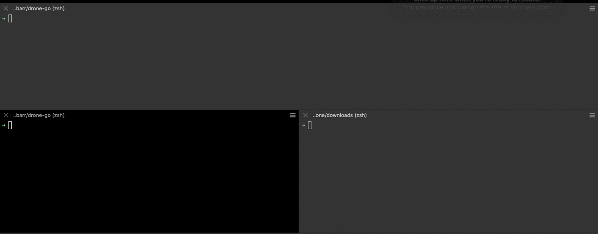

# Drone

Drone is a simple cli file tranfer utility that is able to concurrently send multiple files in fragments and reconstruct them on the receiving end

## Setup Prerequisites

- Go

## Setup Instructions

- Clone the repo by running the following command

  ```shell
  git clone https://github.com/Lobarr/drone-go.git && cd drone-go
  ```

- Install dependencies

  ```shell
  go mod tidy
  ```

- Build executable

  ```shell
  make build
  ```
  
If you've made it here, you're all set!

## Demo


